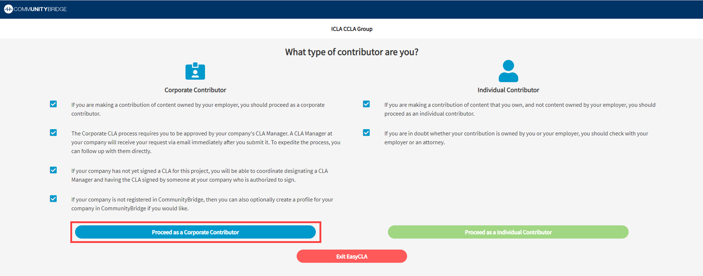
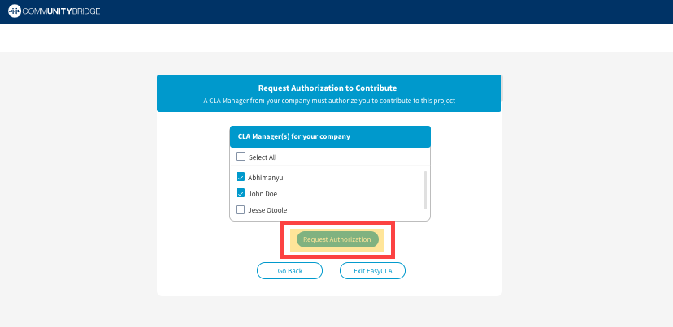
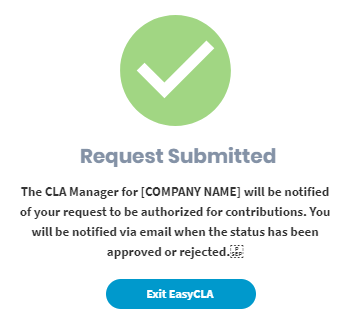
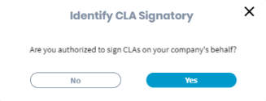
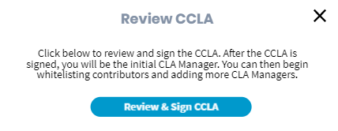
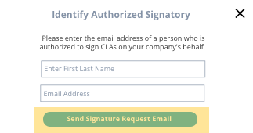
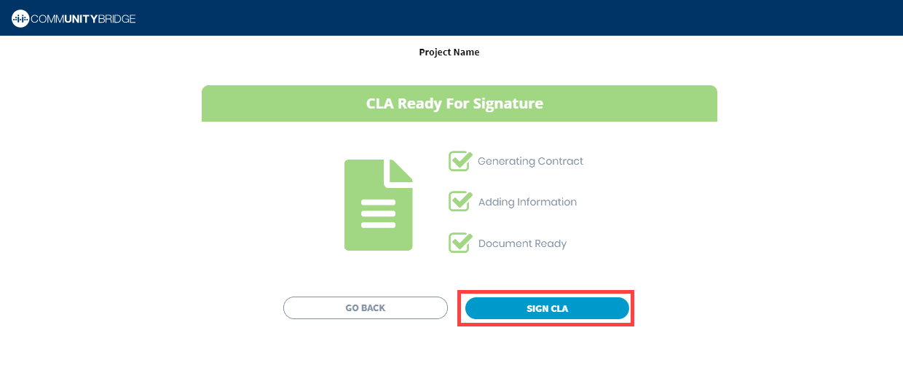
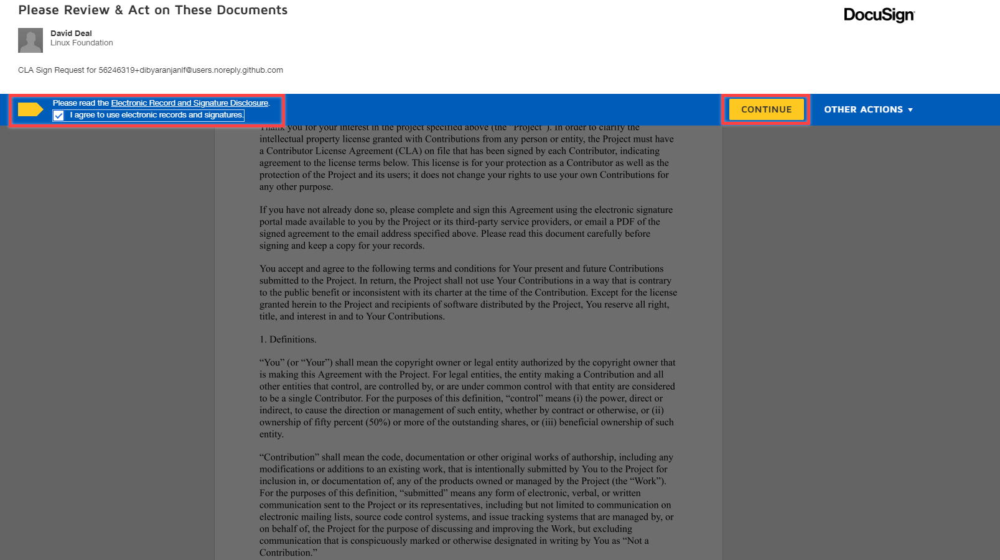
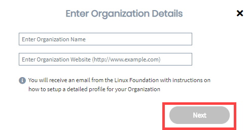

# Contribute to a Corporate GitHub  Project

As a corporate \(employee\) contributor to an open-source project, you create a pull request in GitHub to inform code maintainers about changes made to the code. If any of your contributions to the project are created as part of your employment, the work may not belong to you—it may be owned by your employer. In that case, the CCLA signatory represents the employer \(company\) for legal reasons, and signs the Corporate Contributor Licensing Agreement \(CCLA\) in order for your contribution to be accepted by the company. During the pull request process, your CLA status is verified.

When all CLA management set-up tasks are complete and your CCLA signatory has signed a Corporate CLA, you simply confirm your association to the company during your first pull request. Then you can continue with your pull request. Your subsequent contributions will not require association confirmations.

**Do these steps:**

_If you are a project manager, make sure that you are logged out of the CLA Management Console before you begin._

1. In GitHub, go to the repository that is linked to the project for your organization.

2. Make a change and send a pull request.

3. EasyCLA checks the CLA status of all committers involved in that pull request.


1. EasyCLA marks a cross or a tick beside contributor names involved in that pull request based on their CLA status.
2. A cross next to your contributor name means the CLA check failed.


4. Click   or **Please click here to be authorized**.  
**Note:** The Authorize CommunityBridge: EasyCLA dialog appears.

5. Click **Authorize LF-Engineering**. \(Subsequent contributions will not require authorization.\)

​​

The CLA Contributor Console appears.

6. Click **Proceed as a Corporate Contributor**.   
**Note:** To contribute to this project, you must be authorized under a signed Contributor License Agreement. You are contributing your work on behalf of a company.

7. On **Select Organization** window, type organization name in the filed, select the organization from the drop-down list, and click **Proceed**.

8. Continue:

* [If Company has signed CLA](contribute-to-a-corporate-github-project.md#if-a-confirmation-of-association-with-statement-appears)
* [If Company has not signed CLA](contribute-to-a-corporate-github-project.md#if-the-select-company-dialog-appears)
* [If Company is not in the List](contribute-to-a-corporate-github-project.md#if-the-select-company-dialog-appears-1)

## If Company has signed CLA 

**CLA manager\(s\) for your company** window appears informing you that the company has signed CLA.

1. Select CLA manager\(s\) from the drop-down list whom you want to request for authorizing you to contribute.

* **Go Back:** Takes you to the previous screen.
* **Exit EasyCLA:** Cancels the CLA signing process.

2. Click **Request Authorization**.  
A dialog appears and informs you: Request Submitted ​

3. Click **Exit EasyCLA**.  
_****_The CLA  manager adds you to the approved list.

You are redirected to GitHub. Wait a few seconds for the CLA status to update or refresh the page. **\(IS THIS CORRECT? IS THE CLA SIGNED CHECKMARK SHOWS AFTER FEW MINUTES EVEN WHEN THE USER SENDS REQUESTS TO BE ADDED TO APPROVE LIST \)**

A tick appears next to your branch. A notification appears:

4. Click **Merge pull request** and confirm the merge.

## If Company has not signed CLA 

**No Signed CLA Found** window appears informing you that the company has not signed CLA.

1. Click an answer: **Are you authorized to be a CLA Manager for your organization?**

* [Yes](contribute-to-a-corporate-github-project.md#if-you-are-authorized)
* [No](contribute-to-a-corporate-github-project.md#if-you-are-not-authorized)

### If **You are** Authorized

1. A **Configuring CLA Manager Settings** window appears. After the configuration settings is completed, click **Proceed**.  
  


I**mportant:** If you don't have a username \(LFID\) associated with Linux Foundation, you will be re-directed to Linux Foundation page to create a username. After you create a username, you will be re-directed back to corporate console where you can proceed with CLA signing.


2.  Click an answer: **Are you authorized to sign CLAs on your company's behalf?**  
  

* **Yes**— **Review CCLA** window appears. Click **Review & Sign CCLA**, and continue to step 4.  **** 
* **No**— An **Identify Authorized Signatory** form appears. Continue to next step.   

3. Complete the form, and click **Send Signature Request Email**.  
A success window appears confirming that the signature request is sent to the email address of the individual who signs the Corporate CLA, and adds you to the approved list.

4. After CCLA preparation is completed, click **SIGN CCLA** on CCLA Ready for Signature window.  
**Result:** You will be redirected to complete the DocuSign process

5. Select the checkbox, click **CONTINUE**,  and follow the instructions in the DocuSign document, sign it, and click **FINISH**.

You are redirected to GitHub. Wait a few seconds for the CLA status to update or refresh the page. A tick appears next to your branch. A notification appears:

6. Click **Merge pull request** and confirm the merge.

### If You are not Authorized

1. An **Identify CLA Manager** form appears.

3. Complete the form, and click **Submit Request**, ****Or if you don't know email address of CLA Manager of your company, click **Contact Company Admin**.  
**Result:** A window appears confirming that request is submitted to respective individual who signs a Corporate CLA and adds you to the approved list.

4. Click **Exit EasyCLA**.  
You can contribute after the authorized representative signs a corporate CLA, and adds you to the approved list.

## If Company is not in the List 

1. Click **+Click Here** next to **Organization not listed?**

2. ****Provide organization name and website URL on **Enter Organization Details** window, and click **Next**.

3. A window appears confirming that the organization is successfully added. Click **Proceed**, and continue to [step 1 of Company has not signed CLA](contribute-to-a-corporate-github-project.md#if-the-select-company-dialog-appears).  
**Note: Company Already Exists** window appears if the company is already added to the list.

